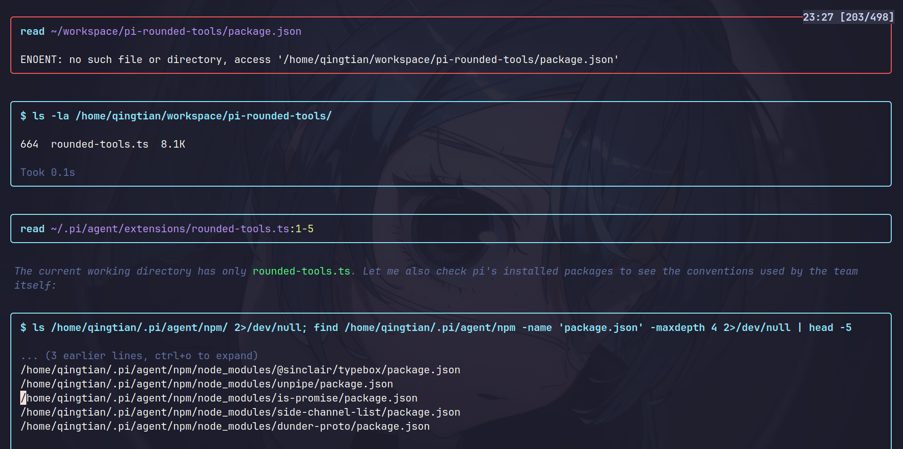

# pi-rounded-tools

Rounded-corner frames for pi's built-in tool calls and results.

Re-registers the seven built-in tools (`read`, `write`, `edit`, `bash`, `grep`, `find`, `ls`) with `renderShell: "self"` and wraps each tool call and result in a frame drawn with Unicode rounded-corner characters (`╭ ╮ ╰ ╯ ─ │`).

No left color bar, no theme matching — just the corners. Border color follows `theme.fg("border", …)` so it adapts to your theme.



## Install

```bash
pi install npm:pi-rounded-tools
```

Or try it without installing:

```bash
pi -e npm:pi-rounded-tools
```

Then `/reload` inside pi (only needed for the regular `install`, not for `-e`).

## What it does

- Wraps the inner renderer of each built-in tool in a `RoundedFrame`. Tool previews, syntax highlighting, diff stats, etc. are all preserved — we just add a frame around what pi already renders.
- Stacks `tool_call` and `tool_result` into one continuous frame using `open-bottom` / `open-top` modes so there's no double border between them.
- Skips the frame during partial / streaming renders to avoid flicker; only wraps once the tool settles.
- Picks border color from tool state: `warning` (yellow) while running, `error` (red) on failure, `border` (theme default) on success — mirroring pi's own 3-state scheme.

## Compatibility

This extension **re-registers the built-in tools**. It will conflict with any other extension that also overrides `read`, `write`, `edit`, `bash`, `grep`, `find`, or `ls`. If you only need a subset, edit the `tools` array at the bottom of `rounded-tools.ts`.

## Uninstall

```bash
pi remove npm:pi-rounded-tools
```

## License

MIT